#  Heart Disease Prediction using MLOps

## Overview
This repository demonstrates a complete MLOps workflow for predicting heart disease from clinical data. The project covers data preparation, model development, experiment tracking, API deployment, containerization, orchestration, monitoring, and CI/CD.

## Key Features
- Data preprocessing and feature engineering
- Exploratory Data Analysis (EDA)
- Model training and evaluation
- MLflow experiment tracking
- FastAPI inference service
- Docker and Kubernetes deployment
- Prometheus metrics and Grafana dashboards
- GitHub Actions automation

## Workflow
```text
Dataset
   ↓
Preprocessing
   ↓
EDA
   ↓
Model Training
   ↓
MLflow Tracking
   ↓
FastAPI Service
   ↓
Docker
   ↓
Kubernetes
   ↓
Monitoring (Prometheus + Grafana)
```

## Tech Stack
| Component | Tool |
|---|---|
| Language | Python 3.11 |
| ML | Scikit-learn |
| API | FastAPI |
| Tracking | MLflow |
| Containers | Docker |
| Orchestration | Kubernetes |
| Monitoring | Prometheus & Grafana |
| CI | GitHub Actions |

## Running the Project

```bash
git clone <repository-url>
cd Heart-Disease-MLOps-Pipeline
pip install -r requirements.txt
python -m src.train
uvicorn api.main:app --reload
```

Visit `http://localhost:8000/docs` to test the REST API.

## API Endpoint

**POST** `/predict`

Returns:
- Predicted class
- Confidence score
- Risk probability

## Monitoring
- Prometheus: `http://localhost:9090`
- Grafana: `http://localhost:3000`

## CI Pipeline
GitHub Actions automates dependency installation, testing, linting, model training, and artifact generation.


### Fastapi Endpoint

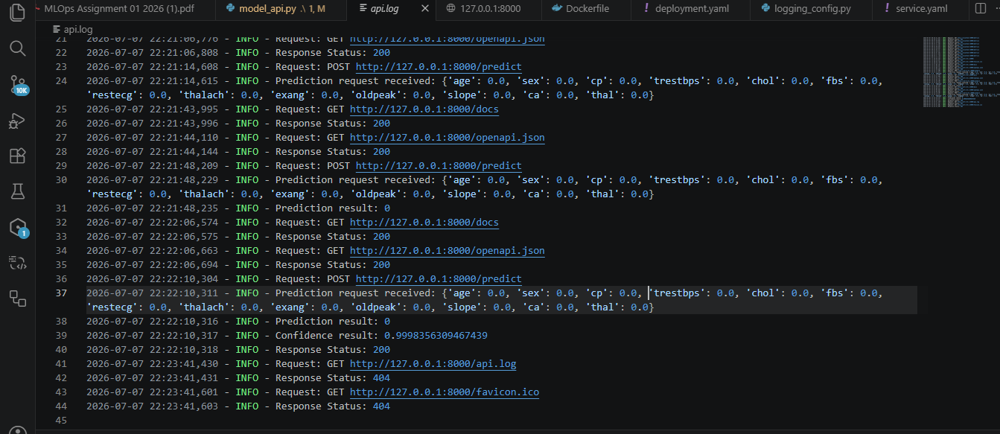

### Swagger Ui

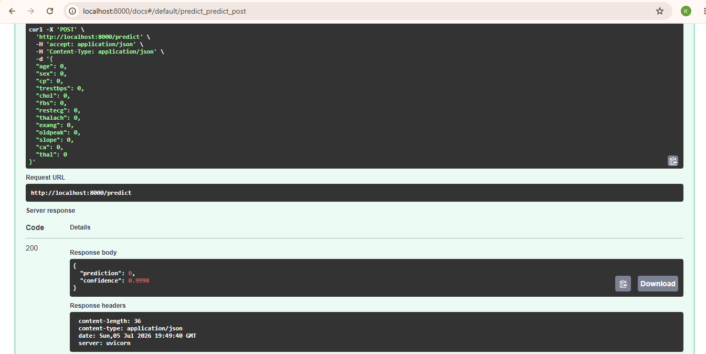

### Swagger Results

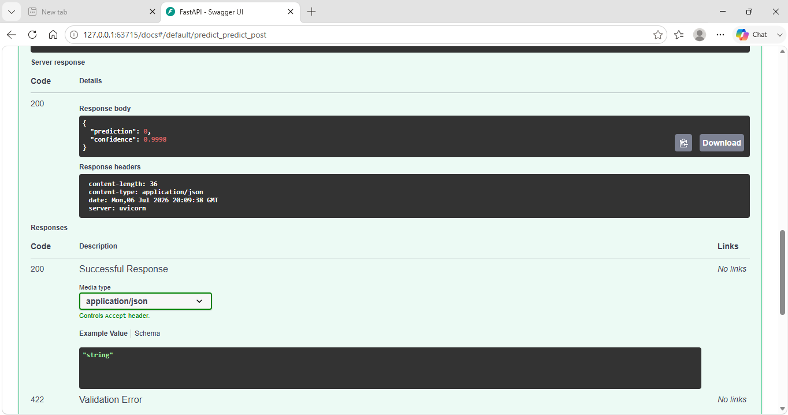

### Docker Image

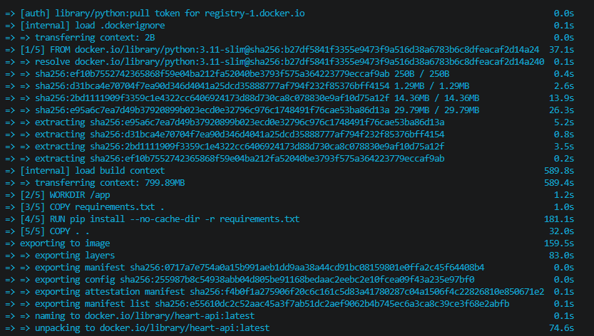

### Container Running

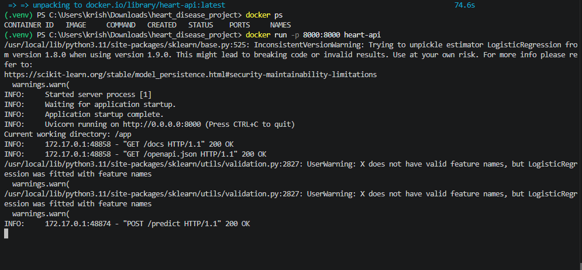

### Kubectl Get Deployments

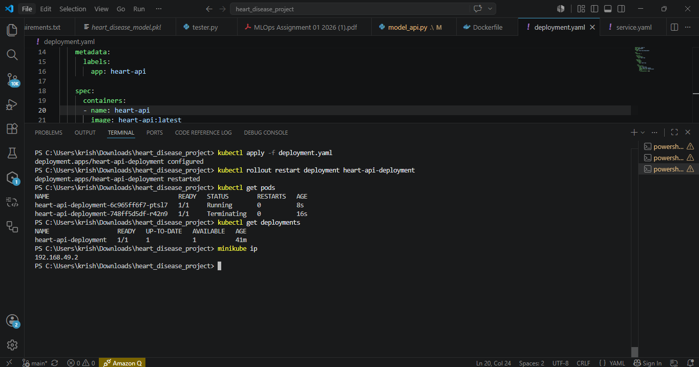
### Kubectl Get Svc

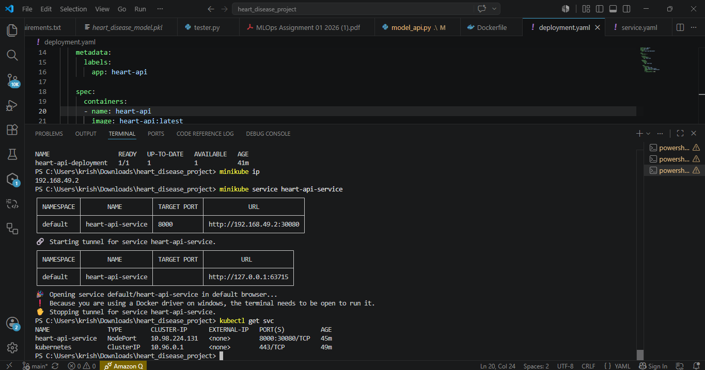

### Minikube Service

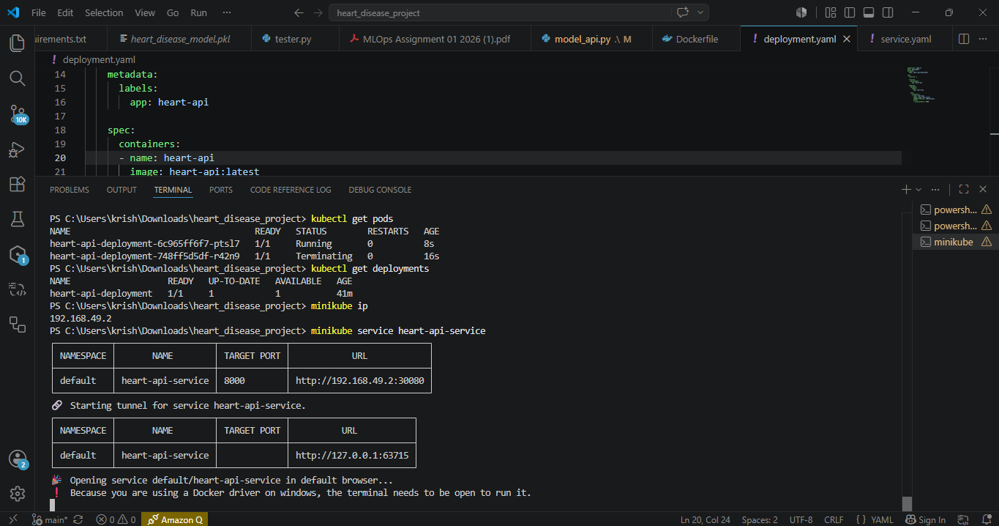

### Minikube Start

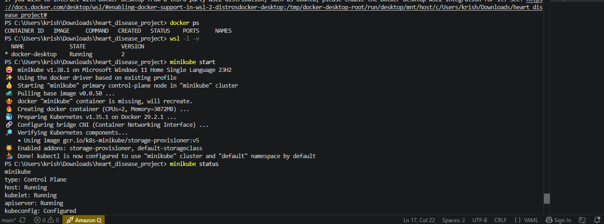

### Minikube Status

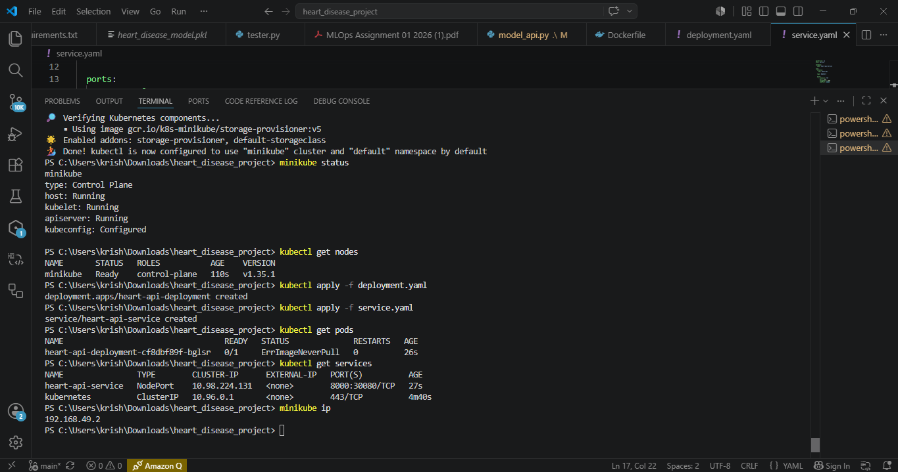

### Mlflow Runs

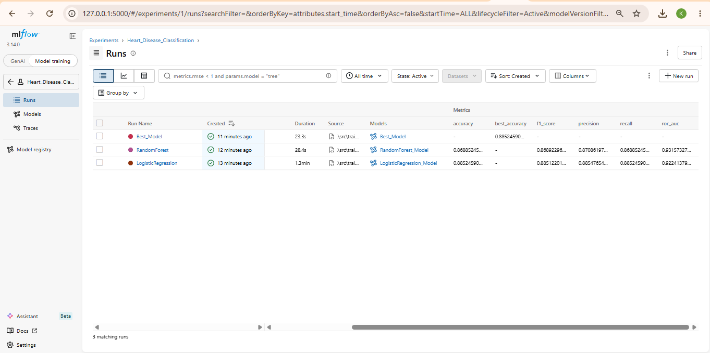

### Prometheus Dashboard

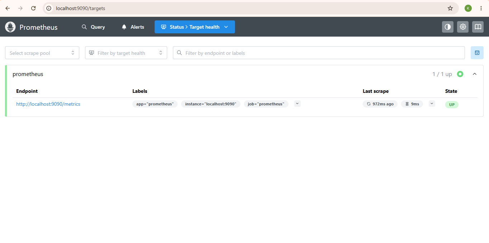

### Prometheus Query Table

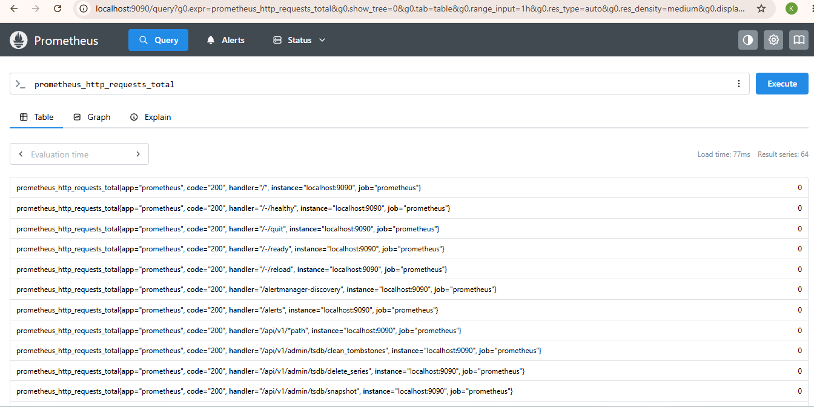

### Grafana Dashboard

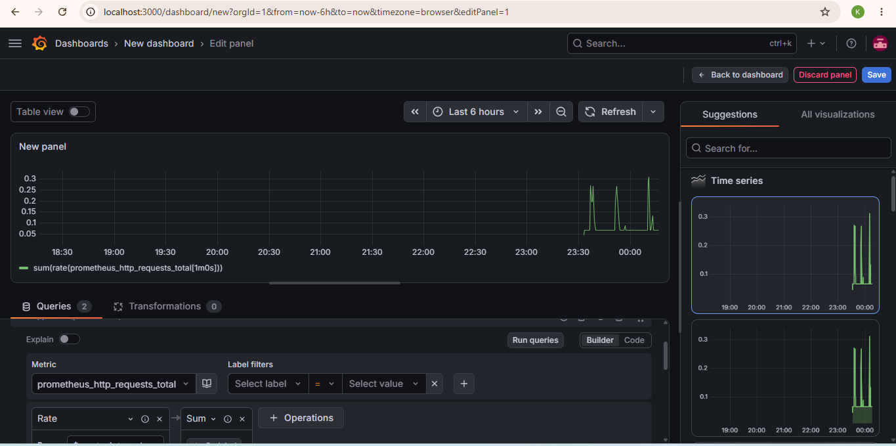

### Metrics Log

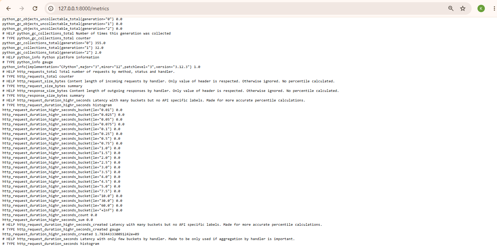


## Author
**Krishna Priya R**
